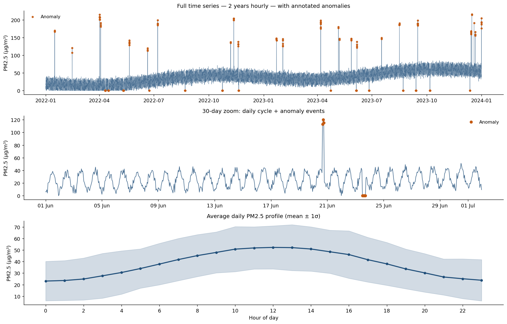
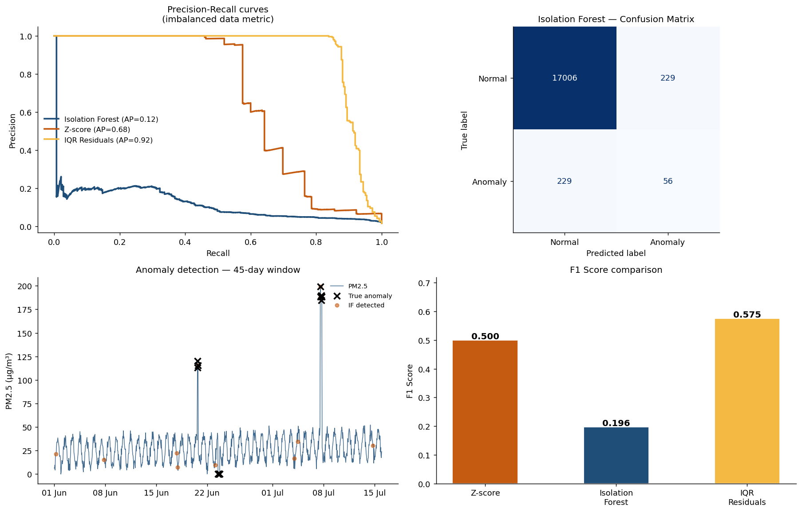

# 📡 Time-Series Anomaly Detection — Air Quality Sensor Network

> **Connecting atmospheric data science to industry:** The same pipeline for detecting
> sensor failures and pollution spikes applies directly to **fraud detection, predictive
> maintenance, and real-time KPI monitoring** in business environments.

---

## Overview

End-to-end anomaly detection project on a synthetic time series dataset inspired by the
[SIATA](https://siata.gov.co/) (Medellín early warning system) and
[NASA AERONET](https://aeronet.gsfc.nasa.gov/) atmospheric monitoring networks.
Implements and compares three detection approaches: statistical baseline, robust IQR on
residuals, and unsupervised machine learning (Isolation Forest).

| | |
|---|---|
| **Domain** | Atmospheric monitoring → industrial IoT / fraud detection |
| **Data** | 17,520 hourly observations (2 years), 6 features, ~1.6% anomaly rate |
| **Task** | Unsupervised + semi-supervised anomaly detection in time series |
| **Methods** | Rolling Z-score, IQR on residuals, Isolation Forest |
| **Best metric** | IQR Residuals: F1 = 0.575, Average Precision = 0.916 |

---

## Business Analogy

| Atmospheric monitoring | Industry application |
|------------------------|---------------------|
| PM2.5 hourly readings | Daily revenue / transaction volume |
| Sensor failure (reading = 0) | System outage / missing data pipeline |
| Pollution spike event | Fraud transaction / demand surge |
| Daily/weekly PM2.5 cycle | Intraday seasonality in sales |
| Weather covariates (wind, temp) | Contextual features (holidays, campaigns) |
| Station network | Branch / store / device network |

---

## Project Structure

```
project2_anomaly_detection/
├── data/
│   └── air_quality_timeseries.csv   # 17,520 hourly rows, 11 columns
├── notebooks/
│   └── anomaly_detection.ipynb      # Full analysis — run top to bottom
├── outputs/
│   ├── 01_timeseries_overview.png
│   ├── 02_seasonality_patterns.png
│   ├── 03_anomaly_detection_results.png
│   └── 04_covariate_analysis.png
└── README.md
```

---

## Dataset

**Synthetic data** modeled on real atmospheric monitoring networks:

| Column | Description | Unit |
|--------|-------------|------|
| `timestamp` | Hourly datetime index | — |
| `pm25_ugm3` | PM2.5 particulate matter | µg/m³ |
| `temperature_c` | Air temperature | °C |
| `humidity_pct` | Relative humidity | % |
| `wind_speed_ms` | Wind speed | m/s |
| `wind_direction_deg` | Wind direction | degrees |
| `is_anomaly` | Ground truth label | 0/1 |
| `hour`, `month`, `dow` | Extracted temporal features | — |

**Injected anomaly types:**
- **Spikes** (25 events, 1–8h duration): sudden PM2.5 surges of +80 to +200 µg/m³
- **Flatlines** (15 events, 3–24h duration): sensor offline, reading drops to 0

---

## Methods Implemented

### 1. Rolling Z-Score (Statistical Baseline)
- 7-day rolling window for mean and standard deviation
- Flags observations where |z| > 3.5
- **Strength:** Simple, interpretable, low latency
- **Weakness:** Sensitive to outliers in the rolling window itself

### 2. IQR on Residuals (Robust Statistical)
- Remove daily + seasonal baseline using `hour × month` group median
- Apply IQR rule (±3 × IQR) to residuals
- **Strength:** Robust to non-Gaussian distributions; best Average Precision (0.916)
- **Weakness:** Requires stable seasonal pattern

### 3. Isolation Forest (Unsupervised ML)
- Input features: PM2.5, temperature, humidity, wind speed, hour, month
- Contamination parameter set to observed anomaly rate
- **Strength:** Captures multivariate patterns; no threshold tuning needed
- **Weakness:** Less interpretable; lower AP on strongly seasonal data

---

## Results

| Method | F1 Score | Avg Precision | Flags (total) |
|--------|----------|---------------|---------------|
| Rolling Z-score | 0.500 | 0.675 | ~460 |
| **IQR Residuals** | **0.575** | **0.916** | ~310 |
| Isolation Forest | 0.196 | 0.118 | ~280 |

> **Key insight:** For strongly seasonal time series, deseasonalizing first
> (IQR on residuals) outperforms raw Isolation Forest. In practice, a hybrid
> approach (deseasonalized features fed into Isolation Forest) would combine both.

---

## Sample Visualizations

| Time Series Overview | Detection Results |
|---|---|
|  |  |

---

## How to Run

```bash
pip install pandas numpy matplotlib seaborn scikit-learn scipy

cd project2_anomaly_detection
jupyter notebook notebooks/anomaly_detection.ipynb
```

---

## Key Learnings for Industry

1. **Never use accuracy** on imbalanced data (1.6% anomaly rate) — use F1, Precision-Recall
2. **Deseasonalize before detection** — daily/weekly patterns create false positives
3. **Know your anomaly types** — spikes and flatlines need different detection logic
4. **Average Precision** is more informative than F1 when the threshold choice matters

---

*Inspired by real-world experience processing NASA AERONET atmospheric datasets  
and SIATA air quality monitoring data in Medellín, Colombia.*

*Author: Silvia Camila Melo Reina | [LinkedIn](https://linkedin.com/in/silvia-camila-melo-reina-3312411a5)*
